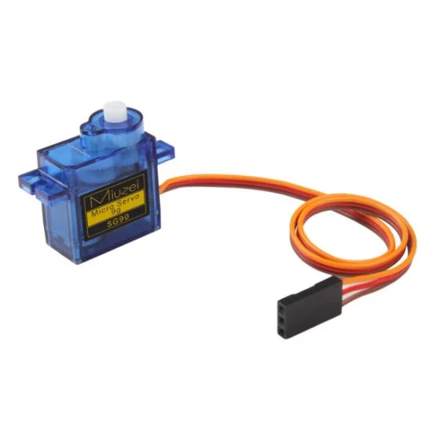
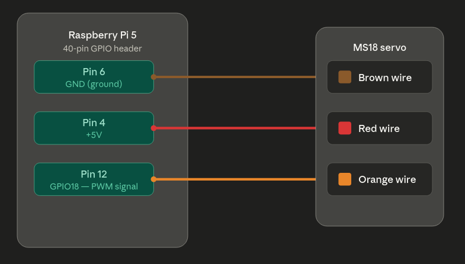

# Interface Micro Servo MS18 with Raspberry Pi using ROS2 Jazzy
This repository serves as a guideline for beginners to create the interface between a Micro Servo MS18 with a Raspberry Pi (RPi) using ROS2 Jazzy.

A small program is executed to publish the angle of the servo motor in the `servomotor` topic, and rotates the angle to generate motion and test the proper working of the application.

## Hardware & Software Requirements
The hardware required to follow the guideline is:
- Micro Servo 9g MS18.
- Raspberry Pi 5 4GB RAM.
- Dupont female-female wires for connections.

  

Software requirements:
- ROS2 Jazzy on Ubuntu 24.04 LTS Server

## Electrical Installation
The electrical circuit to be performed from the servo to the RPi is the following one:
- Red wire MS18 --> Pin 4 RPi
- Yellow wire MS18 --> Pin 12 RPi
- Brown wire MS18 --> Pin 6 RPi

  

